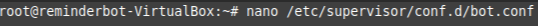
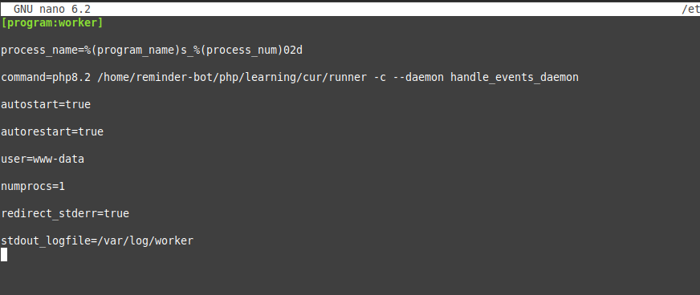
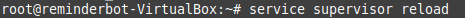
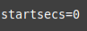
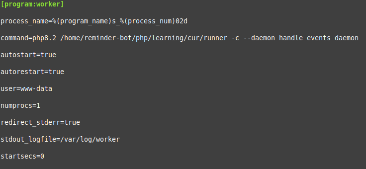
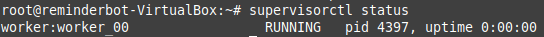
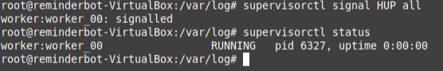

# Вокруг PHP – экосистема веб-приложений

### Домашнее задание № 1.

Домашнее задание написано на последних слайдах в презентации.

Код с семинара, скачать и понять https://drive.google.com/file/d/1aW53N1R7cxP5OPtgifjrEWn2KkJVDXgU/view?usp=sharing
Конфиг супервизора, положить в /etc/supervisor/conf.d

```
[program:worker]
process_name=%(program_name)s_%(process_num)02d
command=php8.2 ПУТЬДОФАЙЛА_RUNNER -c handle_events_daemon
autostart=true
autorestart=true
user=www-data
numprocs=1
redirect_stderr=true
stdout_logfile=/var/log/worker
```

```
php runner -c save_event --name 'name' --receiver 1 --text 'text' --cron '* * * * *' * * * * * php runner -c handle_events
```

### Решение:

Закидываем файлы в нужную папку (в нашем случае: /home/reminder-bot/php/learning/cur/), затем редактируем файл в супервизорде:



Получаем следующий конфиг:



Перезагружаем супервизорд:



Однако в моем случае после проверки статуса запуска возникает ошибка:

, которая в нашем случае решается добавлением строчки:  в конфиг

Итоговый конфиг:



Снова перезагружаем супервизорд:


Теперь всё выглядит правильно и скрипт загружается:



Теперь попробуем остановить процесс:



Как мы видим, процесс перезапустился.
